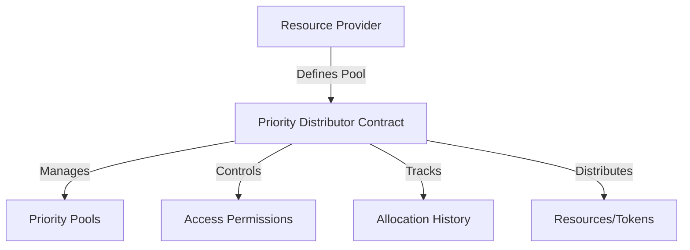

# Proven Priority Distributor

## Overview

Proven Priority Distributor is a decentralized smart contract system designed to manage resource allocation based on configurable priority rules. By leveraging the Stacks blockchain, this contract provides a transparent, secure, and flexible mechanism for distributing tokens, access rights, or other digital resources.

## 🌟 Key Features

- **Dynamic Priority Management**: Create and configure priority pools with granular control
- **Secure Access Control**: Implement multi-level permission systems
- **Transparent Allocation**: Full on-chain tracking of distribution events
- **Flexible Resource Distribution**: Adaptable to various use cases

## 🏗 Architecture

The system uses a core smart contract to manage priority pools, permissions, and allocation tracking. Here's the system overview:



### Core Components
- Priority Pool Management
- Permission System
- Resource Allocation Tracking
- Access Control Mechanisms

## 📦 Contract Documentation

### priority-distributor.clar

#### Permission Levels
- NONE (0): No access
- VIEW (1): Read-only access
- ALLOCATE (2): Can request resources
- ADMIN (3): Full control of pool

#### Key Data Structures
- `priority-pools`: Stores pool metadata
- `pool-permissions`: Tracks user access levels
- `allocation-history`: Records distribution events

## 🚀 Getting Started

### Prerequisites
- Stacks Wallet
- Clarinet
- Node.js

### Installation
1. Clone the repository
2. Install dependencies
3. Deploy using Clarinet

```bash
git clone https://github.com/example/proven-priority-distributor
cd proven-priority-distributor
clarinet deploy
```

### Basic Usage

1. Create a Priority Pool:
```clarity
(contract-call? .priority-distributor create-priority-pool 
    "research-grants"   ;; Pool ID
    u3                  ;; Max priority levels
    tx-sender           ;; Pool creator
)
```

2. Grant Pool Access:
```clarity
(contract-call? .priority-distributor grant-pool-access
    "research-grants"   ;; Pool ID
    user-principal      ;; Grantee
    u2                  ;; Priority Level
)
```

## 📋 Function Reference

### Pool Management
- `create-priority-pool`: Initialize a new distribution pool
- `delete-priority-pool`: Remove a pool
- `get-pool-details`: Retrieve pool information

### Permission Management
- `grant-pool-access`: Set user access level
- `revoke-pool-access`: Remove user access
- `check-pool-permission`: Verify access rights

### Allocation Management
- `allocate-resources`: Distribute resources based on priority
- `get-allocation-history`: Review past distributions

## 🛠 Development

### Testing
```bash
clarinet test
```

### Local Development
```bash
clarinet console
```

## 🔒 Security Considerations

### Key Security Features
- Immutable allocation tracking
- Granular access control
- Owner-managed pools
- Transparent distribution mechanisms

### Best Practices
1. Use the lowest permission level required
2. Regularly audit pool access
3. Implement multi-signature controls for critical pools
4. Keep private keys secure

### Potential Limitations
- Gas costs for complex allocations
- Block size constraints
- Priority level complexity

## 🤝 Contributing

1. Fork the repository
2. Create feature branches
3. Submit pull requests
4. Follow code quality guidelines

## 📄 License

MIT License